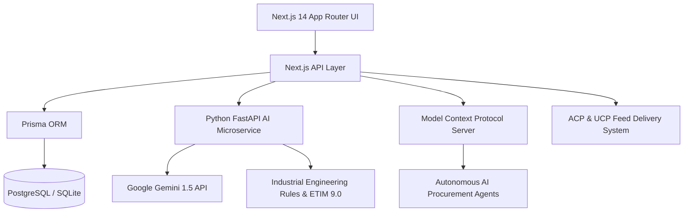

# ⚡ CatalogForge — AI-Powered Industrial Catalog Intelligence

> **Transform fragmented, noisy industrial supplier data into structured, validated, explainable, and commerce-ready product records — natively compliant with 2026 AI Agentic Commerce standards (OpenAI/Stripe ACP & Google UCP).**

[](https://nextjs.org/)
[](https://www.typescriptlang.org/)
[](https://tailwindcss.com/)
[](https://www.prisma.io/)
[](https://fastapi.tiangolo.com/)
[](LICENSE)

---

## 🌟 Executive Summary & Problem Solved

Industrial B2B distributors handle tens of thousands of technical SKUs supplied across heterogeneous formats (PDF spec sheets, messy spreadsheets, legacy ERP dumps). Catalog ingestion suffers from:
1. **Low Completeness & Inconsistent Taxonomy**: Missing standard electrical specifications, ETIM 9.0 codes, and eCl@ss parameters.
2. **Invisible to Autonomous AI Agents**: 2026 autonomous procurement agents (OpenAI/Stripe Agentic Commerce Protocol, Google Universal Commerce Protocol) bypass products missing GTIN identity or commerce metadata.
3. **Black-Box AI Risk**: B2B distributors cannot trust generative AI without strict field-level provenance, confidence scoring, and audit trails.

**CatalogForge** solves this with an end-to-end workspace featuring automated AI taxonomy mapping, cross-field physics validation rules, golden benchmark gap analysis, ACP/UCP delivery pipelines, and an embedded Model Context Protocol (MCP) server.

---

## 🚀 Key Features

### 1. 🛡️ 2026 Agentic Commerce Compliance Center
- **OpenAI / Stripe ACP Engine**: Evaluates required trade fields (`item_id`, `gtin`, `title`, `description`, `price`, `availability`, `seller_name`, `return_policy`).
- **Google UCP Engine**: Validates logistic metadata (`shipping_weight`, `shipping_dimensions`, `tax_category`).
- **Real-Time Visibility Scoring**: Categorizes catalog items into **Trusted (>95%)**, **Penalized (80-95%)**, and **Invisible (<80%)** agent tiers.
- **Feed Push & Delivery Orchestration**: Pushes live feeds to ACP/UCP simulated registries, tracking `FeedDeliveryJob` execution logs and HTTP responses.
- **1-Click AI Auto-Fill**: Automatically generates compliant commercial metadata for unpopulated fields.

### 2. 🔍 Deep Field-Level Explainability & Version Snapshots
- **Provenance Badging**: Clear differentiation between `HUMAN` and `AI_GENERATED` values with confidence ratings (0–100%).
- **AI Reasoning Tracing**: Direct visibility into the heuristic and LLM logic behind each suggested attribute.
- **Audit & Version History**: Full snapshot diffs and immutable audit trail capturing who changed what, previous values, and change rationales.

### 3. 💬 Embedded AI Catalog Copilot
- Interactive slide-out natural language assistant for queries such as:
  - *"How many products are missing GTINs?"*
  - *"Show catalog compliance summary"*
  - *"Which suppliers have the lowest quality?"*

### 4. ⚖️ Side-by-Side Product Comparison Matrix
- Compare up to 3 technical products side-by-side across commercial specs, ETIM taxonomy codes, fill rates, and dynamic electrical attributes.

### 5. 📊 Executive Stakeholder Report Generator (`/api/export/report`)
- One-click generation of a standalone, printable HTML presentation dashboard summarizing catalog health KPIs, supplier quality leaderboards, and live feed delivery statuses.

### 6. 🔌 Model Context Protocol (MCP) & Schema.org Diff Engine
- Standardized `POST /api/mcp` JSON-RPC 2.0 endpoint exposing `search_products`, `get_product`, and `check_compliance` for autonomous LLM agents (Claude Desktop, Cursor, Antigravity).
- Built-in Schema.org JSON-LD diff tester in Settings to compare structured data against catalog records.

### 7. 📥 Multi-Supplier Ingestion Hub
- CSV / Excel upload with automatic schema parsing.
- Gemini AI column-to-taxonomy mapping with confidence scoring and manual override dropdowns.

### 8. 🏢 Multi-Tenant Role-Based Access Control
- Pre-configured personas (`ADMIN`, `EDITOR`, `SUPPLIER`, `VIEWER`) with a restricted **Supplier Portal** view and quick switcher.

---

## 🏗️ Architecture



---

## 🛠️ Tech Stack

| Layer | Technology | Description |
|---|---|---|
| **Frontend** | Next.js 14+ (App Router), TypeScript | Server & Client Components, Suspense |
| **Styling** | Tailwind CSS, Lucide Icons | Custom Zinc Dark Theme, Micro-animations |
| **Database** | SQLite (Local) / PostgreSQL (Vercel Production) | Prisma ORM with 10 Relational Models |
| **AI Microservice** | Python 3.11, FastAPI, Pydantic | Gemini API + Industrial Fallback Heuristics |
| **Protocols** | ACP, UCP, MCP, Schema.org | 2026 AI Agent Commerce Standards |
| **Deployment** | Vercel (Frontend/API) + Any Python Host | Zero-config serverless compatibility |

---

## 💻 Quick Start (Local Development)

### 1. Prerequisites
- **Node.js**: v18.17+ or v20+
- **Python**: v3.10+
- **Git**

### 2. Clone Repository & Install Dependencies
```bash
git clone https://github.com/Harsh110906/CatalogForge.git
cd CatalogForge

# Install Node dependencies
npm install
```

### 3. Setup Python AI Microservice
```bash
# Windows
python -m venv .venv
.\.venv\Scripts\python -m pip install -r python_service/requirements.txt

# Linux/macOS
python3 -m venv .venv
source .venv/bin/activate
pip install -r python_service/requirements.txt
```

### 4. Initialize Database
```bash
# Push Prisma schema to SQLite
npx prisma db push

# Seed 32 industrial products across 6 electrical categories
npm run seed
```

### 5. Configure Environment Variables (`.env`)
Create a `.env` file based on `.env.example`:
```ini
DATABASE_URL="file:./dev.db"
PYTHON_MICROSERVICE_URL="http://localhost:8000"
GEMINI_API_KEY="" # Optional: App includes rich industrial rule fallbacks
NEXT_PUBLIC_CLERK_PUBLISHABLE_KEY=""
CLERK_SECRET_KEY=""
```

### 6. Run the Application
In **Terminal 1** (Python AI Microservice):
```bash
# Windows
.\.venv\Scripts\python python_service/main.py

# Linux/macOS
python python_service/main.py
```

In **Terminal 2** (Next.js Web Workspace):
```bash
npm run dev
```

Open [http://localhost:3000](http://localhost:3000) in your browser.

---

## 🚀 Vercel Deployment

Deploying CatalogForge to Vercel is seamless:

1. **Import Repository**: Import `Harsh110906/CatalogForge` on [Vercel](https://vercel.com).
2. **Environment Variables**:
   - `DATABASE_URL`: Your PostgreSQL connection string (Vercel Postgres, Neon, Supabase, etc.).
   - `PYTHON_MICROSERVICE_URL`: URL of your deployed Python FastAPI service (Render, Railway, Fly.io, or AWS Lambda).
   - `GEMINI_API_KEY`: Your Google Gemini API key.
3. **Build Command**: `npm run build` (automatically runs `prisma generate && next build`).
4. **Deploy**: Click Deploy.

---

## 🧪 Automated Testing & Verification

CatalogForge includes a full verification test suite:

```bash
# Run comprehensive verification suite
python test_full_suite.py
```

Tests verify:
- ✅ Next.js Analytics API & Metrics
- ✅ Product CRUD, GTIN validation & benchmark diffs
- ✅ AI Chat Copilot responses
- ✅ MCP Protocol JSON-RPC tool calls
- ✅ Executive Report HTML generation
- ✅ 2026 ACP & UCP feed exports and push delivery jobs
- ✅ All 10 web routes rendering HTTP 200 OK

---

## 📄 License

This project is licensed under the MIT License — see the [LICENSE](LICENSE) file for details.
